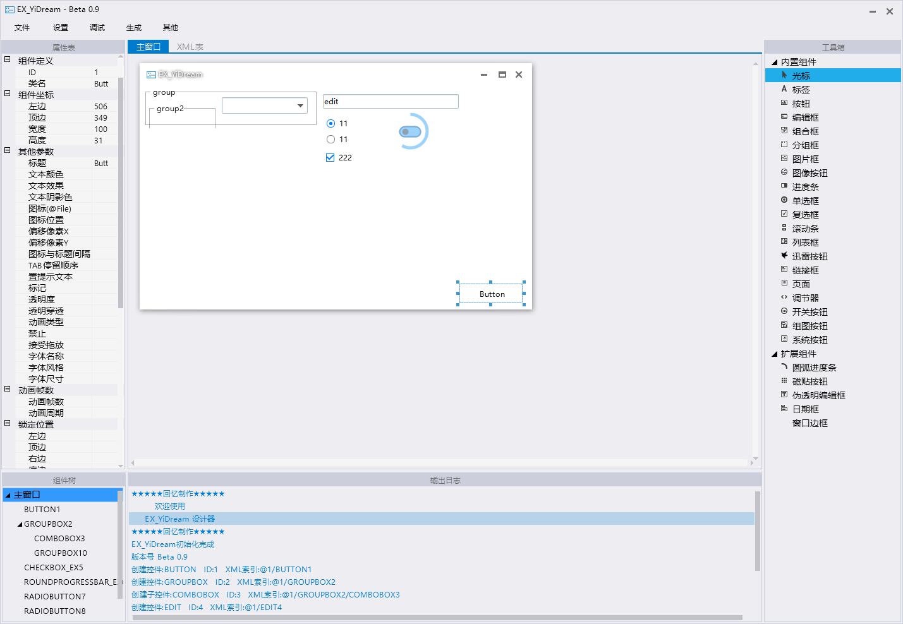

# HYGUI

> **警告：**  
> 库开发中,当前仅供技术预览.
  

跨平台的GUI库，基于SDL3窗口管理,Skia绘图后端。

# 构建方法

- `git submodule init`
- `git submodule update`
- 构建skia(modules/projects/skia)
  > 可以参考我的博客文章  
  > [windows编译SKIA](https://blog.hyiy.top/archives/30/)
- 使用cmake构建
  ```cmd
    mkdir build
    cd build
    cmake ..
    cmake --build .
  ```
  > 运行Debug下的HelloWorld试试吧

# 说明

以Skia为绘图后端,SDL3抽象窗口管理的跨平台GUI库，使用C接口导出，支持各种语言(C/C++/GO/Python/Rust等)调用。

# 构想
曾经在易语言使用ExDui手搓了一套设计器,但是因为个人技术转型,加上易语言的局限性,这个ui已经跟不上个人的节奏。
构想中的UI框架:
- 尽可能的少依赖,小体积,打包后可以单文件分发(GO的单文件分发真的太香了T^T)
- 无任何版权问题(点名批评QT)
- 一致性的跨平台支持(windows/linux/macos)

> 技术原型与风格参照以前的设计器制作(希望有一天框架的实用性能达到图示程度😂)
> 


# 计划

- [ ] 支持窗口主题
- [x] 窗口事件
    - [ ] windows/linux/macos
      - [x] 进行中
    - [ ] android(待定)
    - [ ] ios(待定)
    - [ ] web/webassembly(待定)
- [ ] 完善窗口绘制
  - [x] 进行中
- [ ] 完善子组件绘制
    - [ ] 组件消息
        - [x] 进行中
    - [x] 组件绘制
    - [x] 组件嵌套绘制
- [ ] 局部重绘
- [ ] 跨平台支持
    - [x] windows
    - [x] linux
    - [x] macos
    - [ ] android
    - [ ] ios(待定)
    - [ ] web/webassembly(待定)
- [ ] 抽象/封装skia相关api
    - [ ] 绘图
    - [ ] 字体
    - [ ] 图片
    - [ ] 文本
- [ ] 动画机制
- [ ] 硬件加速
- [ ] 扩充组件
    - [x] 基类组件
    - [ ] 布局组件
        - [ ] 线性布局
        - [ ] 网格布局
        - [ ] 流式布局
        - [ ] ...
    - [ ] 标签(Label)
        - [x] 作为第一个扩展组件开发中
    - [ ] 按钮(Button)
    - [ ] CheckBox
    - [ ] RadioBox
    - [ ] TextBox
    - [ ] ...
- [ ] 主题包
- [ ] 内嵌资源
- [ ] 多语言绑定/包装
    - [x] C
    - [x] C++
    - [ ] GO
    - [ ] Python
    - [ ] Rust
    - [ ] ...
- [ ] ...

# 相关项目

[google/skia](https://github.com/google/skia)
[libsdl-org/SDL](https://github.com/libsdl-org/SDL)
[nemtrif/utfcpp](https://github.com/nemtrif/utfcpp)
